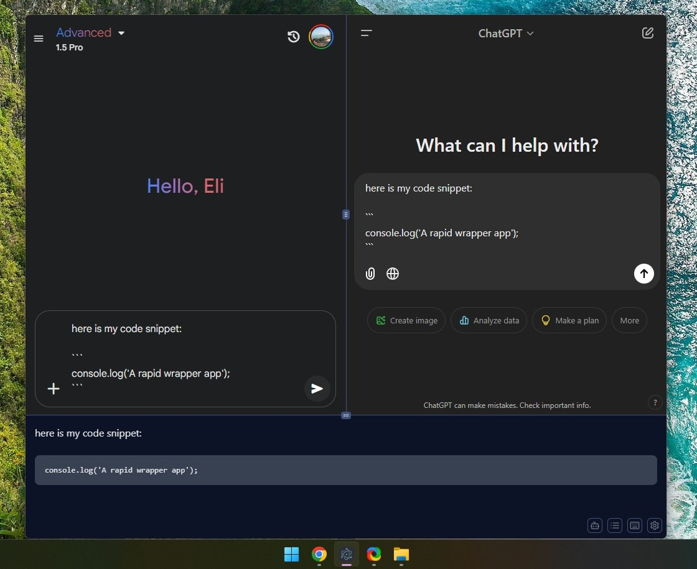

# Wrapid - a rapid wrapper app for chat bots

**Wrapid** is a desktop application for users who want to enhance the experience of using their favorite chatbots.
Wrapid provides a single / multi-chat mode (side by side), a prompt palette, a rich text area (with Markdown support), and a global hotkey to easily bring up Wrapid and start typing.

    
    

## Features

### 1. Flexible Chatbot Selection
- **Single Chat Mode**: Select one AI chatbot (e.g., Gemini, ChatGPT, or Claude) and interact with it directly in the app.
- **Multi-Chat Mode**: Choose two chatbots to use at the same time. The app displays both chatbots side by side.
  - In multi-chat mode, a text area at the bottom allows users to write prompts that are automatically sent to both chatbots simultaneously.

### 2. Prompt Palette
- Enriched with prompts from [awesome-chatgpt-prompts](https://github.com/f/awesome-chatgpt-prompts).
- Select a prompt to insert it directly into the chatbot's input field (or into the shared text area in multi-chat mode).

### 3. Rich Text Area
- Supports full markdown formatting, allowing you to style your prompts with headings, lists, links, code snippets, and more.

    
    

### 4. Dynamic Window Behavior
- **Floating Mode**: Freely control the window's size and position on your screen.
- **Sticky Mode**: Anchor the app to the bottom-left, bottom-center, or bottom-right of your screen with predefined size options.

### 5. Configurable Global Hotkey
- Set a global hotkey to instantly open the app window.
- Automatically focuses on the chatbot input field (or the shared text area in multi-chat mode) for a seamless workflow.

## Installation
1. Download and install the latest release from the [Latest Release](https://github.com/elisoftli/wrapid/releases/latest) page.

## Keyboard Shortcuts
1. Focus app - `Alt+Space`
2. Open Prompt Palette - `Ctrl+P`
3. Reload chats - `Ctrl+R`
4. Send prompt in rich text area - `Ctrl+Enter`
5. Restore last sent prompt into rich text area - `Ctrl+Shift+Z`
6. Change window size in `sticky` mode - `Ctrl+1`/`Ctrl+2`/`Ctrl+3`/`Ctrl+4`
7. Change window position in `sticky` mode - `Ctrl+Alt+Left`/`Ctrl+Alt+Right`

## Support
If you encounter any issues or have feature requests, please feel free to open an issue and I'll try to tackle it as soon as possible.

---
